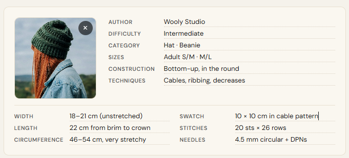
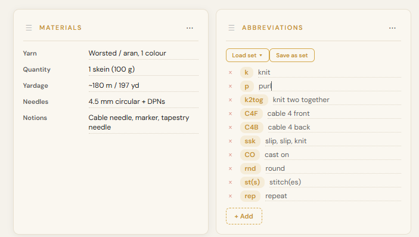
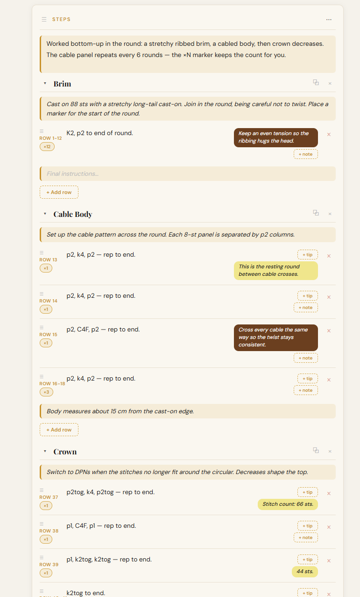
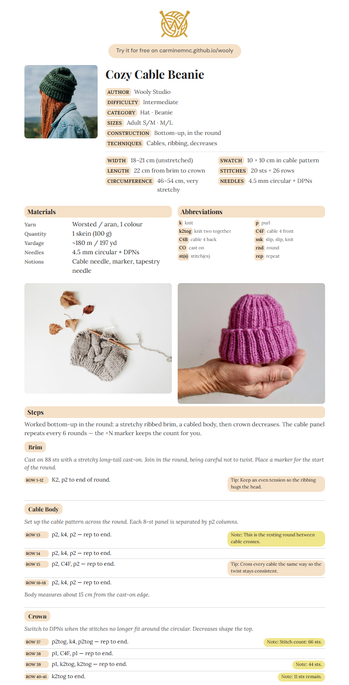

<!-- _class: hero -->

The free pattern editor for knitters and crocheters — right in your browser, no account, always with you

<a href="https://carminemnc.github.io/wooly/">carminemnc.github.io/wooly</a>

---

01 · The Problem

## Your patterns deserve better than this

- Messy Word documents that drift out of sync
- Photos of handwritten notes, hard to read months later
- PDFs you found online — impossible to tweak or reuse
- Paper notes that get lost or ruined mid-project

Patterns end up scattered, hard to find, and even harder to share clearly.

---

02 · What is Wooly

## An editor built for the craft, not the cloud

  Made for makers
  No cloud, no lock-in — just a fast, focused editor.
  

    FreeNo accountOfflineBilingual
  

  Runs in your browserNo install, no sign-up, no subscription.

  Yours, on your devicePatterns are stored locally — never uploaded.

  

    Works offlineOnce opened, it keeps working without internet.
  

  

    InstallableAdd it to your phone or tablet like a real app.
  

---

<!-- _class: divider -->

Building a Pattern

# From blank page to finished chart

---

<!-- _class: screenshot -->

## A cover page that says it all

Screenshot — pattern cover with photo, author, difficulty, category and techniques

---

The Cover

## Everything you need before casting on

- Project photo, right at the top
- Author, difficulty, category, techniques used
- Measurements and gauge, ready to check at a glance

Everything a maker needs before starting, in a single view.

---

<!-- _class: screenshot -->

## Materials and abbreviations, side by side

Screenshot — Materials and Abbreviations sections displayed together in the editor

---

Abbreviations

## Your shorthand, defined once

- Set up your own abbreviations (k, p, ssk, yo...)
- Save them as a **reusable set** across every pattern you write
- They carry over cleanly into the exported PDF

No more guessing what "mb" meant three patterns ago.

---

<!-- _class: screenshot -->

## Steps, row by row

Screenshot — Steps section with numbered rows, a tip and a note

---

Steps

## Built for working the pattern, not just reading it

- Rows number themselves automatically — even across repeats (×N)
- **Tips** and **notes** stay separate from the instructions
- Split a pattern into pieces (front, back, sleeve...) and work them one at a time
- Reorder anything with a simple drag

---

More Sections

## Video links and free-form notes

- Drop in a tutorial link — it becomes a scannable **QR code** in the PDF
- Custom sections for anything outside the usual structure
- Care instructions, colorway ideas, final notes — your call

---

<!-- _class: divider -->

Sharing Your Work

# From screen to printed page

---

<!-- _class: screenshot -->

## An elegant PDF, ready to print

Screenshot — exported PDF, first page with cover and materials

---

Export

## A PDF made for people who knit, not just print

- Careful pagination — a section never splits awkwardly across pages
- Automatic QR codes for every video link
- Add your own logo and footer for a personal touch
- Export to **JSON** too, for backup or reuse elsewhere

---

Always With You

## Wherever you craft, Wooly follows

  Full backup
  Export everything — patterns, sets, templates — to one file.
  

    JSON exportSmart merge
  

  Light or darkPick the theme that's easiest on your eyes.

  Italian &amp; EnglishSwitch languages to share with any community.

  

    InstallableAdd it to your home screen and open it like an app.
  

  

    Works everywhereDesktop, tablet, or phone — your workflow, your pace.
  

---

<!-- _class: hero -->

# Try it for free

No sign-up. No cloud. Your patterns stay yours.

<a href="https://carminemnc.github.io/wooly/">carminemnc.github.io/wooly</a>

